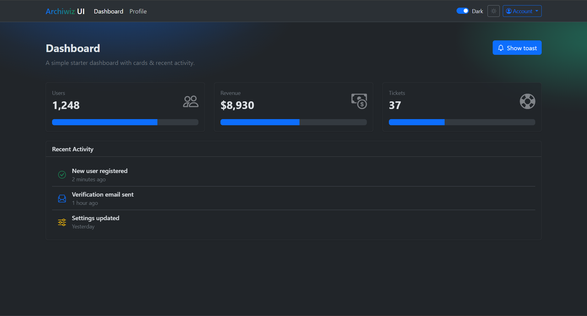
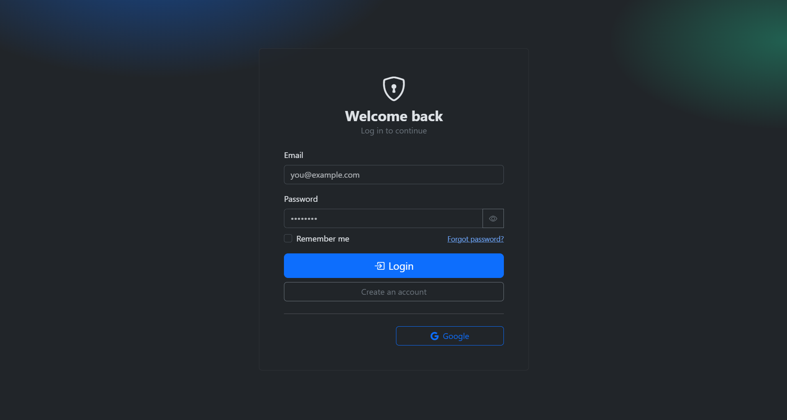
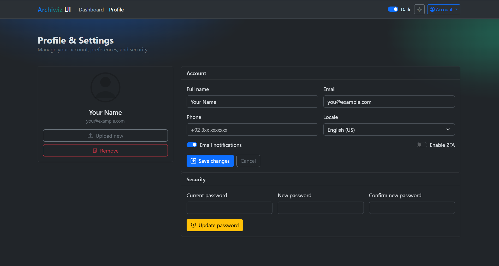
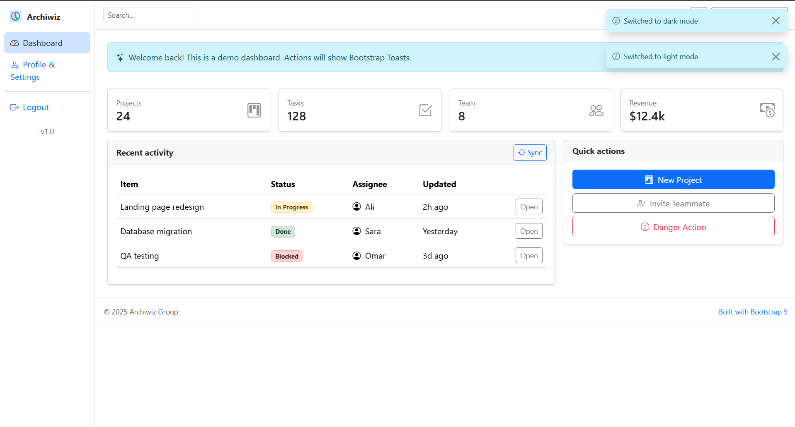

# Auth UI with HTML, CSS, Bootstrap, JS

This is a sample project for Different type of Auth UI interface.

---

## Explore the File

```markdown
following are file explore it read has own README file and enjoy the stuff
```

---

### bootstrap-auth-dashboard


### bootstrap-auth-dashboard-header






### bootstrap-auth-dashboard-sidebar




---
