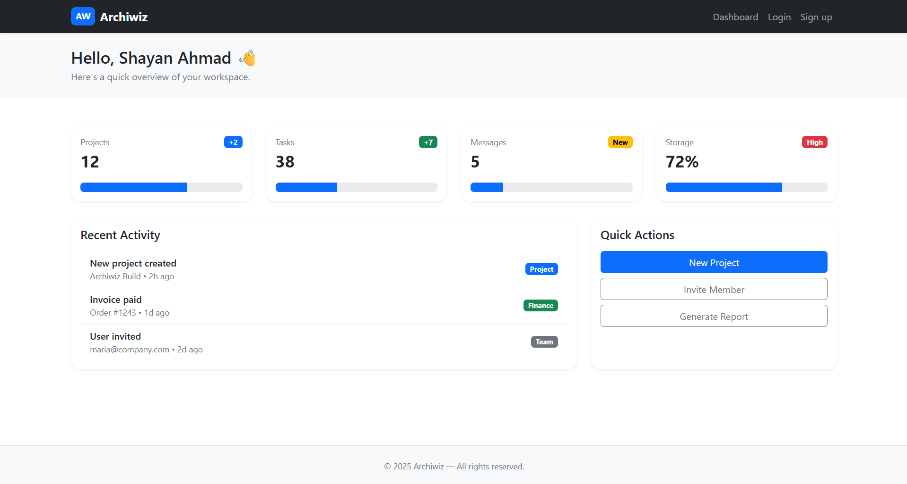
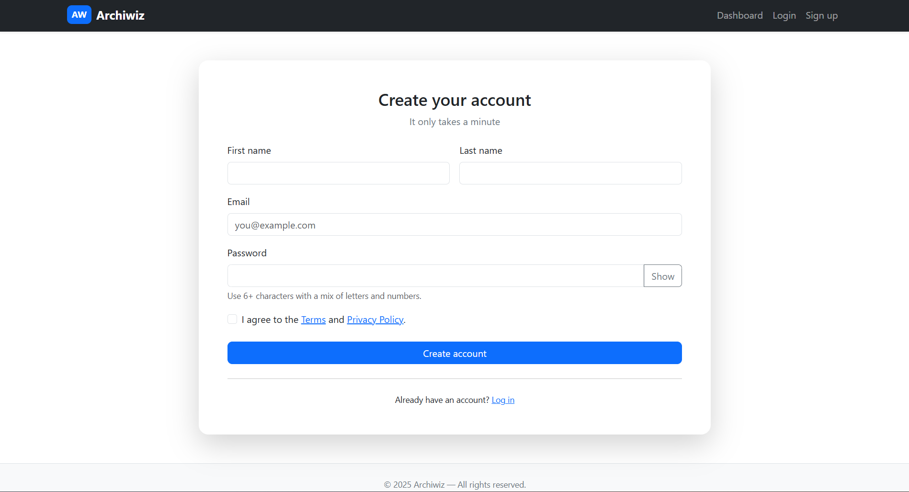
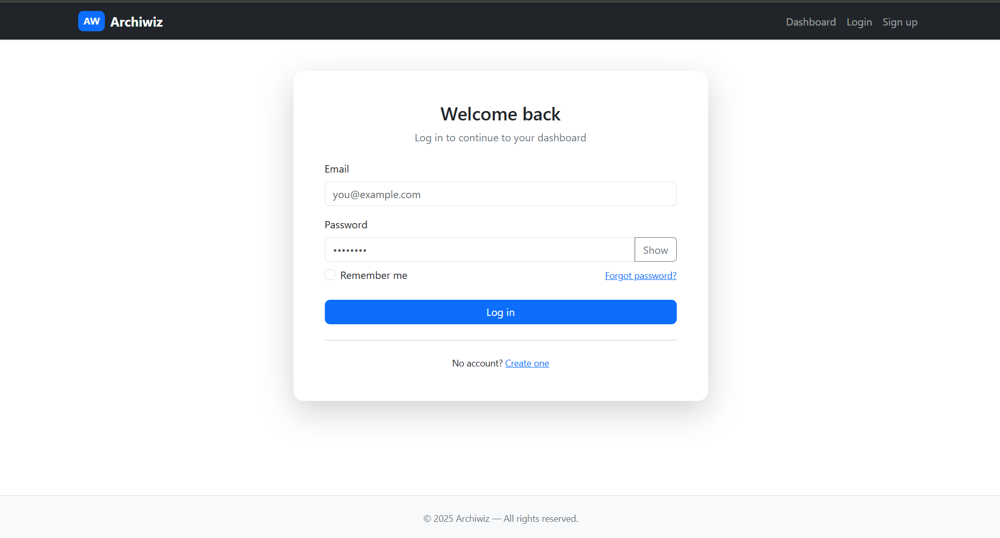
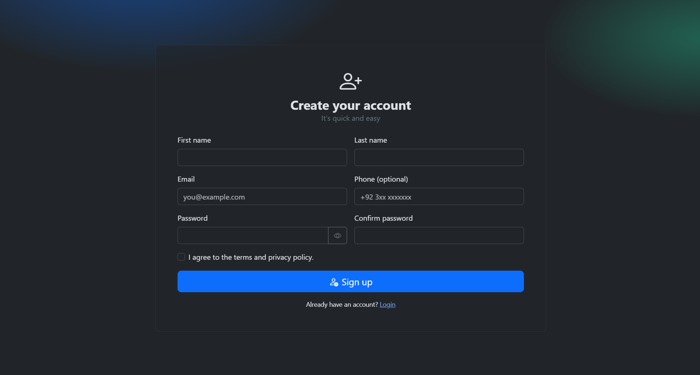
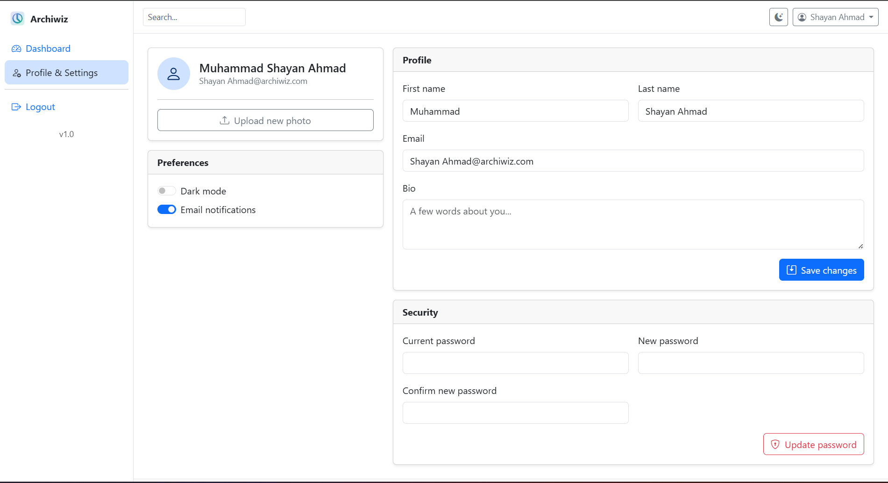
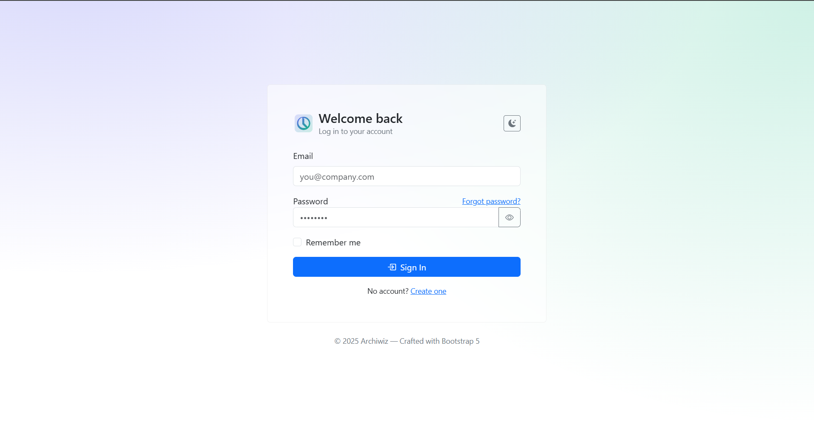
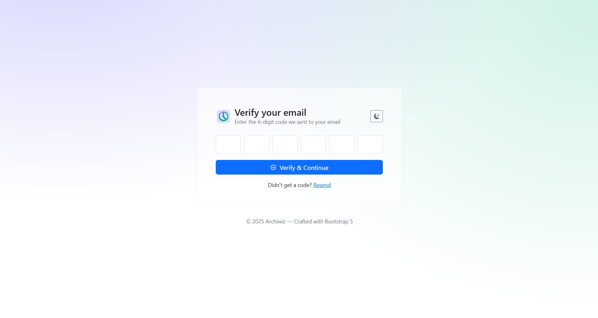

# Auth UI with HTML, CSS, Bootstrap, JS

This is a sample project for Different typy of Auth UI interface.

---

## bootstrap-auth-dashboard

```markdown



```

## bootstrap-auth-dashboard-header

```markdown




```

## bootstrap-auth-dashboard-sidebar

```markdown




```

---
